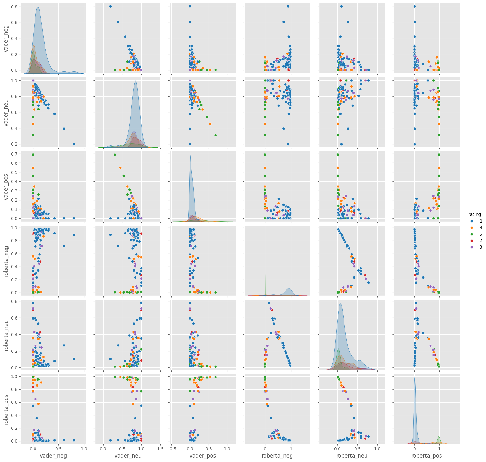

# Sentiment Analysis using VADER and RoBERTa Pre-trained Model

## Overview

This repository has been created with a primary focus on sentiment analysis. Sentiment analysis involves the application of computational methods to determine and understand the emotional tone or sentiment expressed within textual data. In the context of this repository, sentiment analysis is conducted using two powerful models: VADER and RoBERTa.

## Methodology

The sentiment analysis employs two distinct models: VADER, a rule-based sentiment analysis tool suitable for social media text, and RoBERTa, a transformer-based model known for its robust performance in various natural language processing tasks. The analysis assesses the sentiment of McDonald's reviews to gain insights into customer opinions and preferences.

## Data

- McDonald's Reviews by Nidula Elgiriyewithana (Kaggle)

## Analysis

Jupyter Notebooks scripts showcase the sentiment analysis process using VADER and RoBERTa models. The scripts illustrate data preprocessing, model training, and sentiment prediction steps. 

## Results



In the comparison, RoBERTa outperforms VADER in sentiment analysis accuracy. The visual representation demonstrates that RoBERTa provides more accurate predictions across various sentiment categories, showcasing its effectiveness in understanding the nuanced sentiments expressed in the McDonald's reviews.

## Usage

1. Clone the repository:

   ```bash
   git clone https://github.com/strigoimort/sentiment-analysis.git
